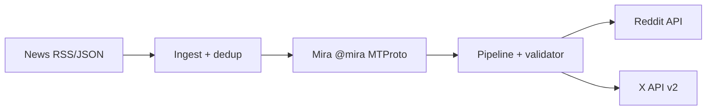

# MiraArticles

Автоматизированный конвейер: **IT-новости → запрос к боту Mira через Telegram MTProto → пост с дисклеймером → публикация в Reddit и X** по расписанию (~каждые 5 часов).

Стек: **Bun**, **Elysia** (health / ручные триггеры), **GramJS** (MTProto), официальные API Reddit и X.

---

## Статус (2026-05-20)

| Фаза | Описание | Статус |
|------|----------|--------|
| 0 | Compliance & discovery | ✅ Закрыта |
| 1 | Telegram MTProto + @mira | ✅ Закрыта |
| 2 | News ingest (RSS/JSON) | ✅ Закрыта |
| 3 | Content pipeline | ✅ Закрыта |
| 4 | Reddit publisher | ⏳ Ожидает |
| 5 | X publisher | ⏸ **Заблокировано** (402 credits) |
| 6 | Scheduler & production | ⏳ Ожидает |

**Дальше:** фаза 4 — `src/publishers/reddit.ts`. Подробный roadmap → [`PLAN.md`](PLAN.md).

---

## Требования

- [Bun](https://bun.sh/) 1.0+
- Аккаунт Telegram + **api_id / api_hash** с [my.telegram.org/apps](https://my.telegram.org/apps)
- Reddit: токен через **Devvit CLI** (`devvit login` → копия в `token/reddit_token.json`)
- X: OAuth в `token/x_token.json` (постинг отложен до пополнения credits)

---

## Быстрый старт

```bash
bun install
cp .env.example .env
# Настроить .env — см. docs/GETTING_STARTED.md (важно: пустые TELEGRAM_API_* перекрывают JSON!)
```

**Telegram (один раз):**

```bash
# Положить api_id/api_hash в token/telegram.json (шаблон: config/telegram.json.example)
bun run telegram:login
bun run test:mira
```

**Проверка ingest и тестов:**

```bash
bun test
bun run ingest:test
```

Операционный runbook, env, фазы 3–6 → [`docs/GETTING_STARTED.md`](docs/GETTING_STARTED.md).

---

## Скрипты (`package.json`)

| Команда | Назначение |
|---------|------------|
| `bun test` | Unit-тесты (news, mira, без сети) |
| `bun run dev` | Elysia dev-сервер (`src/index.ts`, watch) |
| `bun run telegram:login` | Интерактивный MTProto login → `token/telegram.session` |
| `bun run test:mira` | Тестовый промпт @mira (~10–180 с) |
| `bun run ingest:test` | Live fetch RSS/JSON + scoring (smoke фазы 2) |
| `bun run test:x` | Тест поста в X (после credits, `X_ENABLED=true`) |

---

## Структура проекта

```
MiraArticles/
├── PLAN.md                 # Roadmap, архитектура, compliance
├── REVIEW.md               # Code review отчёт
├── README.md
├── package.json
├── .env.example
├── config/
│   ├── sources.yaml        # RSS/JSON источники
│   ├── subreddits.yaml     # Сабреддиты и rollout
│   └── telegram.json.example
├── docs/
│   ├── GETTING_STARTED.md  # Runbook: env, проверки, фазы 3–6
│   ├── compliance.md
│   ├── mira-bot-protocol.md
│   ├── telegram-mira-poc.md
│   ├── news-sources.md
│   ├── subreddit-rules.md
│   └── unsplash.md
├── scripts/
│   ├── telegram-login.ts
│   ├── test-mira-prompt.ts
│   ├── test-ingest.ts
│   └── test-x-post.ts
├── src/
│   ├── index.ts            # Elysia entry
│   ├── config/load.ts
│   ├── mira/               # GramJS client, parser
│   ├── news/               # ingest, dedup, scoring, router
│   └── media/              # Unsplash (опционально)
└── token/                  # .gitignore — секреты только локально
    ├── telegram.json
    ├── telegram.session
    ├── reddit_token.json
    └── x_token.json
```

Целевая структура (pipeline, publishers, scheduler) — [`PLAN.md` §5](PLAN.md).

---

## Документация

| Документ | Содержание |
|----------|------------|
| [`PLAN.md`](PLAN.md) | Цели, фазы, архитектура, ToS, env, риски |
| [`docs/GETTING_STARTED.md`](docs/GETTING_STARTED.md) | Env, проверки фаз, порядок имплементации 3–6 |
| [`docs/telegram-mira-poc.md`](docs/telegram-mira-poc.md) | GramJS, FLOOD_WAIT, команды фазы 1 |
| [`docs/compliance.md`](docs/compliance.md) | Reddit / X / Telegram правила |
| [`docs/news-sources.md`](docs/news-sources.md) | Каталог RSS и теги |
| [`docs/subreddit-rules.md`](docs/subreddit-rules.md) | Риски по сабам (**r/programming: LLM banned**) |

---

## Секреты и безопасность

- **`token/`** и **`.env`** — в `.gitignore`, **никогда** не коммитить.
- Пустые строки `TELEGRAM_API_ID=` / `TELEGRAM_API_HASH=` в `.env` **перекрывают** `token/telegram.json` — оставьте поля закомментированными или удалите, если используете JSON.
- Токены из логов/чатов — **перевыпустить** в порталах.
- Рекомендуется: `chmod 700 token/` и `chmod 600 token/*` после создания сессий.
- **r/programming** — не включать в autopost без явного `ALLOW_R_PROGRAMMING=true` (ban LLM-written content).

---

## Архитектура (кратко)



Полная схема и матрица compliance → [`PLAN.md` §2–4](PLAN.md).

---

## Лицензия

Не указана — добавить при публикации репозитория.
